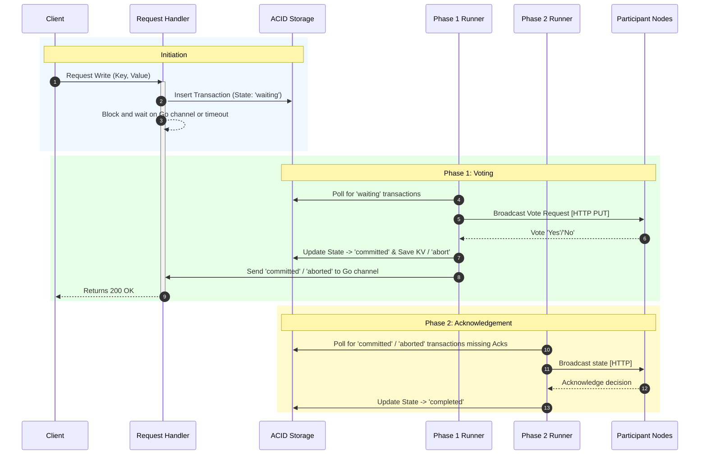
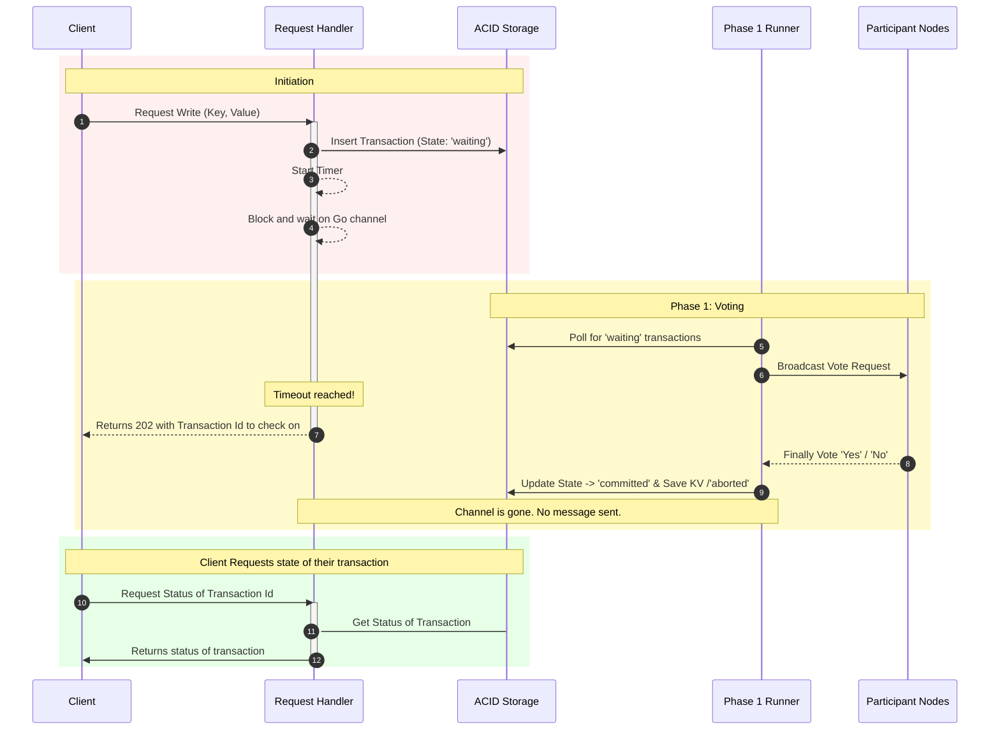

# Simple Distributed Key-Value-Store
This is a simple distributed key-value-store using two-phase-commit to make atomic writes across nodes.
Our project is very simple and should not be used for production rather it was a fun project to learn more about two-phase-commit in practice.

## Architecture

The basic structure is compromised of multiple nodes.
Each node is a go program. A client that wants to read the value for a key or write a value for a key can connect to any of the nodes in the cluster.
For each write the node that received the write request becomes the coordinator for the commit of this request.
It coordinates the commit of the transaction across all the nodes in the cluster using two-phase-commit [Wikipedia](https://en.wikipedia.org/wiki/Two-phase_commit_protocol).

### Lifecycle of a Transaction
To begin a new transaction a client sends a write request to any of the nodes in the cluster, this node becomes the coordinator for this transaction.
The coordinator then starts the two-phase-commit protocol by generating a unique id.
It uses a shared map to register a channel for this transaction id, this channel will be used to send the result of the transaction back to the request handler that is waiting for the result of the transaction.
A timeout is registered for the transaction, if the timeout is reached before the transaction is completed then the request handler will return a _202_ response with the transaction id so the client can request the state of the transaction in the future
After that the handler writes the transaction to the database with the state 'waiting'.
This way we have durable state for the transaction and we can recover from crashes.

A go routine called _phase 1 runner_ is responsible for polling the database for transactions in the 'waiting' state and starting the first phase of the two-phase-commit protocol by sending vote requests to all the nodes in the cluster.
If all the nodes vote 'yes' then the coordinator updates the transaction state to 'committed' and saves the key-value pair to the local database
If the node is unreachable or votes no it updates the transaction state to 'aborted'.
Generally a node will only vote 'no' if it has a lock on the key that is being written by another transaction, this way we can ensure that we do not have race conditions.
Either way the routine will check if there is a channel registered for this transaction id and if there is it will send the result of the transaction to this channel so the request handler can return the result to the client.
Below you will find a sequence diagram for the lifecycle of a transaction with the synchronous response model and the asynchronous response model.

### Synchronous Response Model:

### Asynchronous Response Model:

After having decided the result of the transaction in phase 1, a second go routine called _phase 2 runner_ is responsible for making sure that all the nodes in the cluster acknowledge the decision of the coordinator by broadcasting the decision to all the nodes and waiting for their acknowledgement, once all the acknowledgements are received the transaction state is updated to 'completed' and can be removed from the database in the future.
This is the critical part of the two-phase-commit because we have to retry broadcasting the decision until all the nodes acknowledge it, otherwise we might end up in a situation where some nodes have committed the transaction while others have not, which would lead to an inconsistent state across the cluster.

### Concurrency Control
To ensure that we do not have race conditions when multiple transactions are trying to access the same key we will use a simple locking mechanism.
When a transaction is in the 'waiting' state it will acquire a lock on the key it wants to write, this way we can ensure that no other transaction can write to the same key until the first transaction is either committed or aborted.
If two transactions are trying to write to the same key at the same time on different nodes each of them will acquire a lock on their respective nodes.
Each _phase 1 runner_ will then request the votes from the other nodes, because each transaction will have one node that will vote 'no' because it has a lock on the key both transaction will be aborted.

### Overview of the components and their interactions

### Endpoint Summary

### Endpoints Documentation

| Endpoint | Method | Description | Request Body / Params | Success Response | Error Responses |
| :--- | :--- | :--- | :--- | :--- | :--- |
| `/crud/` | `POST` | Initiates a new transaction to write a key-value pair, initiating the 2PC process. This is the client-facing write endpoint. | JSON: `SetRequest` (`{"key": "...", "value": "..."}`) | `200 OK` or `202 Accepted` (if timeout occurs) | `400 Bad Request`, `409 Conflict`, `500 Internal Server Error` |
| `/crud/{key}` | `GET` | Retrieves the committed value for a given key. | URL Param: `key` | `200 OK` (JSON: `{"key": "...", "value": "..."}`) | `500 Internal Server Error` |
| `/transaction/vote` | `PUT` | Receives a request from a coordinator to prepare a transaction (Phase 1 of 2PC). | JSON: `persistence.Transaction` object | `200 OK` (Text: "Prepared") | `400 Bad Request`, `409 Conflict`, `500 Internal Server Error` |
| `/transaction/ack` | `PUT` | Receives the final decision (commit/abort) from the coordinator (Phase 2 of 2PC). | JSON: `twophasecommitcoordinator.AckRequest` object | `200 OK` (Text: "Final Transaction State received and processed") | `400 Bad Request`, `500 Internal Server Error` |
| `/transaction/status/{transactionId}` | `GET` | Retrieves the current status of a specific transaction by its ID. | URL Param: `transactionId` | `200 OK` (JSON: `{"transactionId": "...", "status": "..."}`) | `500 Internal Server Error` |

## Design decisions made

### Response Model for Commit Decision
Deciding on the response model for the Phase 1 commit decision was a critical design choice. We had to choose between two standard models:
1. **Synchronous:** The request handler blocks until Phase 1 completes, returning the final result immediately.
2. **Asynchronous:** The request handler instantly returns a tracking ID, requiring the client to poll for the final status.

We initially considered the **synchronous model** because it provides a superior, immediate user experience. However, we discarded it due to significant drawbacks:
* **Resource Exhaustion:** If Phase 1 takes a long time (e.g., network latency to participants), the HTTP handler remains blocked. Under heavy load, this could exhaust server connections.
* **Ambiguity on Crash:** If the coordinator crashes while the handler is blocked, the client receives a generic connection error. They will not know if the transaction succeeded or failed, leading to unsafe client-side retries and potential data duplication.

The **asynchronous model** solves these durability issues. The coordinator instantly persists the transaction request and returns an ID. If the server crashes, it recovers the transaction from the database without the client needing to retry. However, strictly forcing clients to poll for every single transaction results in a degraded user experience.

**The Decision: A Hybrid Approach (Async Request-Reply)**
We implemented a hybrid model. The server attempts to process the transaction synchronously within a strict context timeout. 
* If the transaction is decided quickly, we return the final result (e.g., `200 OK`). 
* If the timeout is reached before a decision is made, we return a `202 Accepted` with the transaction ID, allowing the client to poll for the result later. 

**Implementation Details:**
To implement this hybrid model, we considered using an in-memory locking mechanism where the HTTP handler claims a lock, writes to the DB, and attempts to collect votes. We discarded this because it introduces severe lock contention and requires a complex hand-off mechanism for crash recovery.

Instead, we designated the background **Phase 1 Runner** to handle *all* transactions. The HTTP Request Handler simply:
1. Writes the "waiting" transaction to the database.
2. Registers a Go channel tied to the transaction ID.
3. Blocks on that channel using a `select` statement with a timeout.

Because channels are the idiomatic way to handle concurrency in Go, this completely decouples the HTTP lifecycle from the heavy lifting of the Two-Phase Commit, preventing lock contention while maintaining robust crash recovery.

### Usage of an Asynchronous Phase 2 Runner
Using an asynchronous background worker for Phase 2 (broadcasting the final decision) was an obvious choice. In the Two-Phase Commit protocol, once the decision is made in Phase 1, the transaction is guaranteed be eventually consistent in this state across nodes; the actual write in Phase 2 is only a matter of time.

Time, however, is the main variable. A participant node might be completely unreachable for hours in case of a failure scenario. 

We needed a mechanism to retry the broadcast indefinitely until all participants acknowledge the final state. By delegating this to a background **Phase 2 Runner**:
+ **We unblock the client:** We return the success response to the client immediately after Phase 1, rather than making them wait for all network acknowledgements.
+ **We achieve crash-safety:** Our broadcasting mechanism becomes invariant to coordinator crashes. If the coordinator goes down during Phase 2, the runner simply restarts, queries the database for any decided transactions missing acknowledgements, and resumes broadcasting right where it left off.

### Usage of ACID database for durable state
As the main purpose of this project was to learn about two-phase-commit we wanted to save us the trouble of implementing our own durable storage engine.
Therefore we decided to use an existing ACID compliant database to store the state of the transactions, this way we can ensure that we have durable state for the transactions and we can recover from crashes without having to worry about the consistency of the data.
In our current implementation we are using SQLite as the database, however we could easily switch to another database that is ACID compliant if we wanted to.
One might wonder why the ACID compliance is important for our use case.
Atomicity is important because in one transaction on our database we rely on writing the actual data of the transaction as well as the metadata in the same transaction, if we do not have atomicity then we might end up in a situation where we have the data of the transaction written to the database but not the metadata or vice versa, which would lead to an inconsistent state of the transaction and we would not be able to recover from it without help from the client.

The Consistency is important because it helps in ensuring that only one transaction can write to a key at a time, if we do not have consistency then we might end up in a situation where two transactions are trying to write to the same key at the same time and both of them succeed, which would lead to an inconsistent state of the data and we would not be able to recover from it.

The Durability is important because we use the database to store the state of the transactions and their respective metadata, if we do not have durability then we might lose the state of the transactions in case of a crash and we would not be able to recover from it.