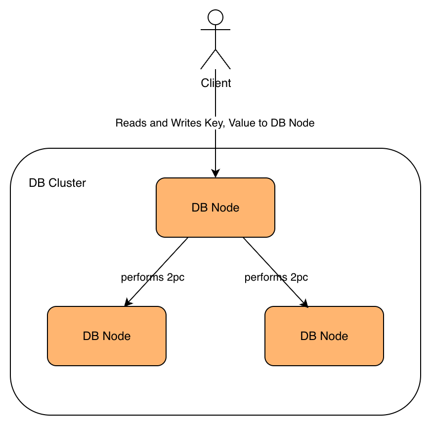
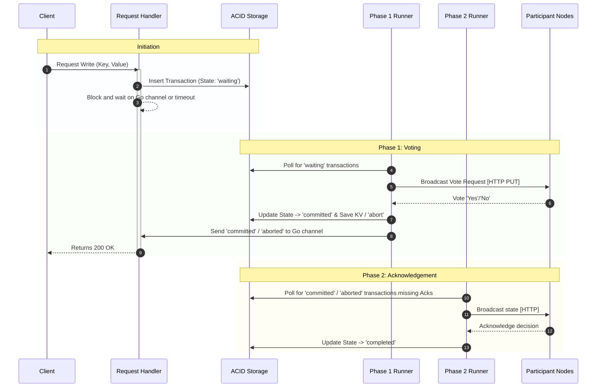
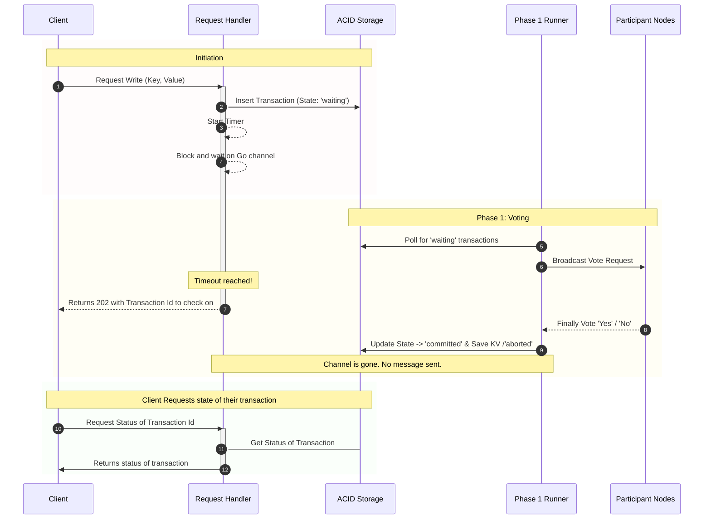
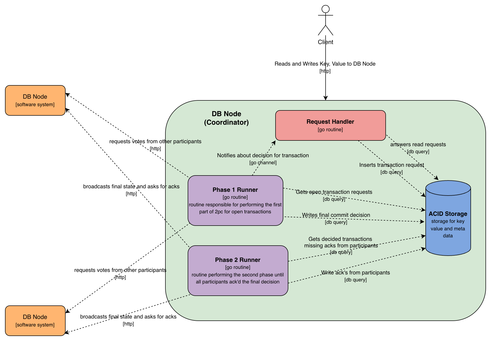

# Simple Distributed Key-Value-Store
This is a simple distributed key-value-store using two-phase-commit to make atomic writes across nodes.
Our project is very simple and should not be used for production rather it was a fun project to learn more about two-phase-commit in practice.

1. [Architecture](#architecture)
2. [Test Setup](#test-setup)


## Architecture

The basic structure is compromised of multiple nodes.
Each node is a go program. A client that wants to read the value for a key or write a value for a key can connect to any of the nodes in the cluster.
For each write the node that received the write request becomes the coordinator for the commit of this request.
It coordinates the commit of the transaction across all the nodes in the cluster using two-phase-commit [2PC Wikipedia](https://en.wikipedia.org/wiki/Two-phase_commit_protocol).

### Lifecycle of a Transaction

When a client sends a write request to any node in the cluster, that node dynamically assumes the role of **Coordinator** for that specific transaction. The transaction then flows through the following asynchronous lifecycle:

**1. Initialization & Durability**
The Coordinator initiates the Two-Phase Commit (2PC) protocol by generating a unique transaction ID. Before making any network calls, it persists the transaction to the local SQLite database in the `waiting` state. This guarantees durable state; if the node crashes immediately after this step, the transaction can be safely recovered.

**2. Channel Registration & Blocking**
The HTTP Request Handler registers a Go channel in a thread-safe, shared in-memory map, keyed by the transaction ID. The handler then blocks, waiting for a signal on this channel, while a timeout ticks down. 
+ If the timeout is reached before the transaction completes, the handler stops waiting and returns a `202 Accepted` response to the client. The client can use the transaction ID to poll for the final status later.

**3. Phase 1: Voting (The Phase 1 Runner)**
Completely decoupled from the HTTP handler, a background goroutine called the _Phase 1 Runner_ continuously polls the database for transactions in the `waiting` state. It broadcasts a "Vote Request" (Prepare) to all other participant nodes in the cluster.
* **Commit:** If all nodes vote 'Yes', the Coordinator updates the local transaction state to `committed` and saves the key-value pair to the local database.
* **Abort:** If any node votes 'No' (typically because it already holds a local lock on that key) or is unreachable, the Coordinator updates the state to `aborted`.

**4. Client Notification**
Immediately after making the Commit/Abort decision, the _Phase 1 Runner_ checks the shared map for an active channel matching the transaction ID. If the channel exists (meaning the HTTP handler hasn't timed out yet), the runner pushes the final state into the channel. The HTTP handler wakes up and synchronously returns the final result (e.g., `200 OK` or `409 Conflict`) to the client.

**5. Phase 2: Acknowledgement & Consistency**
After the Coordinator makes the final commit or abort decision in Phase 1, the transaction is handed off to a secondary background goroutine: the **Phase 2 Runner**. 

This runner is strictly responsible for guaranteeing global consistency. It continuously polls the local database for decided transactions and broadcasts the final decision to all participant nodes. 

Because network partitions happen and nodes can crash, this is a highly critical phase of the Two-Phase Commit protocol. The Phase 2 Runner is designed to indefinitely retry broadcasting the decision until it receives a successful acknowledgement from every single participant. 


Below you will find the sequence diagrams illustrating both the happy-path synchronous response case and the timeout/polling fallback case.

### Synchronous Response Case:

### Asynchronous Response Case:


### Concurrency Control & Conflict Resolution
To prevent race conditions when multiple transactions attempt to access the same key simultaneously, we rely on a combination of local database constraints and the Two-Phase Commit (2PC) voting mechanism.

**Local Locking Mechanism:**
When a transaction enters the `prepared` state on a node, it acquires a local lock on the target key. Rather than using in-memory application locks, we enforce this at the database level using a SQLite partial unique index (`UNIQUE INDEX ON transactions(key) WHERE state = 'prepared'`). This guarantees that no other transaction can prepare or write to that specific key on this node until the active transaction is either committed or aborted.

**Distributed Conflict Resolution (Mutual Abort):**
In a distributed environment, a race condition can occur if two different clients attempt to write to the same key on two different coordinator nodes at the exact same time. 
1. Node A creates Transaction 1 and acquires a local lock on the key.
2. Node B creates Transaction 2 and acquires a local lock on the exact same key.
3. Node A's _Phase 1 Runner_ requests a vote from Node B. 
4. Node B's _Phase 1 Runner_ requests a vote from Node A.

Because Node B already holds a local lock for Transaction 2, it will vote "No" to Node A's request. Conversely, Node A will vote "No" to Node B's request. 

This results in a safe **mutual abort**. Both transactions are rejected, and neither is allowed to commit. Both clients will receive an aborted response, ensuring absolute data consistency across the cluster without requiring a centralized lock manager.

### Overview of the components and their interactions


### Endpoint Summary


| Endpoint | Method | Description | Request Body / Params | Success Response | Error Responses |
| :--- | :--- | :--- | :--- | :--- | :--- |
| `/crud/` | `POST` | Initiates a new transaction to write a key-value pair, initiating the 2PC process. This is the client-facing write endpoint. | JSON: `SetRequest` (`{"key": "...", "value": "..."}`) | `200 OK` or `202 Accepted` (if internal timeout occurs) | `400 Bad Request`, `409 Conflict`, `500 Internal Server Error` |
| `/crud/{key}` | `GET` | Retrieves the committed value for a given key. Returns `409 Conflict` if the key is currently locked by a prepared transaction (2PC in progress). | URL Param: `key` | `200 OK` (JSON: `{"key": "...", "value": "..."}`) | `409 Conflict` (key locked), `500 Internal Server Error` |
| `/transaction/vote` | `PUT` | Receives a request from a coordinator to prepare a transaction (Phase 1 of 2PC). | JSON: `persistence.Transaction` object | `200 OK` (Text: "Prepared") | `400 Bad Request`, `409 Conflict`, `500 Internal Server Error` |
| `/transaction/ack` | `PUT` | Receives the final decision (commit/abort) from the coordinator (Phase 2 of 2PC). | JSON: `twophasecommitcoordinator.AckRequest` object | `200 OK` (Text: "Final Transaction State received and processed") | `400 Bad Request`, `500 Internal Server Error` |
| `/transaction/status/{transactionId}` | `GET` | Retrieves the current status of a specific transaction by its ID. | URL Param: `transactionId` | `200 OK` (JSON: `{"transactionId": "...", "status": "..."}`) | `500 Internal Server Error` |
| `/die` | `POST` | Exits the current program |  | No Response | No Response |


## Design decisions made

### Response Model for Commit Decision
Deciding on the response model for the Phase 1 commit decision was a critical design choice. We had to choose between two standard models:
1. **Synchronous:** The request handler blocks until Phase 1 completes, returning the final result immediately.
2. **Asynchronous:** The request handler instantly returns a tracking ID, requiring the client to poll for the final status.

We initially considered the **synchronous model** because it provides a superior, immediate user experience. However, we discarded it due to significant drawbacks:
* **Resource Exhaustion:** If Phase 1 takes a long time (e.g., network latency to participants), the HTTP handler remains blocked. Under heavy load, this could exhaust server connections.
* **Ambiguity on Crash:** If the coordinator crashes while the handler is blocked, the client receives a generic connection error. They will not know if the transaction succeeded or failed, leading to unsafe client-side retries and potential data duplication.

The **asynchronous model** solves these durability issues. The coordinator instantly persists the transaction request and returns an ID. If the server crashes, it recovers the transaction from the database without the client needing to retry. However, strictly forcing clients to poll for every single transaction results in a degraded user experience.

**The Decision: A Hybrid Approach (Async Request-Reply)**
We implemented a hybrid model. The server attempts to process the transaction synchronously within a strict context timeout. 
* If the transaction is decided quickly, we return the final result (e.g., `200 OK`). 
* If the timeout is reached before a decision is made, we return a `202 Accepted` with the transaction ID, allowing the client to poll for the result later. 

**Implementation Details:**
To implement this hybrid model, we considered using an in-memory locking mechanism where the HTTP handler claims a lock, writes to the DB, and attempts to collect votes. We discarded this because it introduces severe lock contention and requires a complex hand-off mechanism for crash recovery.

Instead, we designated the background **Phase 1 Runner** to handle *all* transactions. The HTTP Request Handler simply:
1. Writes the "waiting" transaction to the database.
2. Registers a Go channel tied to the transaction ID.
3. Blocks on that channel using a `select` statement with a timeout.

Because channels are the idiomatic way to handle concurrency in Go, this completely decouples the HTTP lifecycle from the heavy lifting of the Two-Phase Commit, preventing lock contention while maintaining robust crash recovery.


### Usage of an Asynchronous Phase 2 Runner
Using an asynchronous background worker for Phase 2 (broadcasting the final decision) was an obvious choice. In the Two-Phase Commit protocol, once the decision is made in Phase 1, the transaction is guaranteed be eventually consistent in this state across nodes; the actual write in Phase 2 is only a matter of time.

Time, however, is the main variable. A participant node might be completely unreachable for hours in case of a failure scenario. 

We needed a mechanism to retry the broadcast indefinitely until all participants acknowledge the final state. By delegating this to a background **Phase 2 Runner**:
+ **We unblock the client:** We return the success response to the client immediately after Phase 1, rather than making them wait for all network acknowledgements.
+ **We achieve crash-safety:** Our broadcasting mechanism becomes invariant to coordinator crashes. If the coordinator goes down during Phase 2, the runner simply restarts, queries the database for any decided transactions missing acknowledgements, and resumes broadcasting right where it left off.


### ACID Database Storage
As the main purpose of this project was to learn about the Two-Phase Commit (2PC) protocol, we decided against implementing our own storage engine from scratch. Instead, we rely on an existing ACID-compliant database to safely manage transaction states. 

Currently, we use an embedded SQLite database. However, because our persistence layer is abstracted and decoupled by interfaces, we could easily swap this out for another SQL database like PostgreSQL in the future.

Relying on strict ACID compliance is absolutely critical for the safety of our 2PC implementation:

* **Atomicity:** In a single database transaction, we must write both the actual key-value data *and* the 2PC metadata (like the transaction state). Atomicity guarantees this is an "all-or-nothing" operation. If it fails midway, the database safely rolls back, preventing a corrupted state where data is written but the metadata is lost.
* **Consistency:** Consistency ensures the database strictly enforces our protocol rules. By using features like `UNIQUE` partial indexes and `BEFORE UPDATE` triggers, the database physically rejects invalid state transitions (e.g., trying to move a transaction from 'aborted' back to 'committed', or trying to prepare the same key twice). 
* **Isolation:** Because our Go server processes many HTTP requests concurrently, multiple goroutines might try to lock the same key at the exact same millisecond. Isolation ensures these concurrent requests do not interfere with one another, preventing race conditions and double-writes.
* **Durability:** We use the database as the ultimate source of truth for crash recovery. If the coordinator node loses power during Phase 1 or Phase 2, Durability guarantees that the committed transaction states and participant votes are safely written to disk. When the server restarts, our background runners can read this durable state and seamlessly resume the protocol exactly where it left off.


# Test Setup

Since proving practical distributed systems correct is hard we cannot certainly confirm the correctness of this system and its consistency guarantees.
This outlines our approach in trying to make reasonable strategies to ensure correctness.
Our invariant to test is, that all nodes must be strongly consistent
This means that, if they return a value it must be the same as all other nodes. Nodes may not respond (unavailable due to failure injector) or may return a locked response in case they are still processing the transaction without violating this invariant.
But they may never return an outdated value.
For the test setup a cluster of three instances is created in the [docker-compose.yaml](./docker-compose.yaml).
Additionally a failure injector is added to the cluster that continously calls the `/die`endpoint of the nodes in the cluster.

The [test.sh](./test.sh) file generates load and writes to random keys on random nodes thereby simulating usage of the key-value store.
As too many concurrent requests on the same key can livelock the system as the two-phase-commit protocol mandates that both writes will be aborted we intentionally limited the frequency of writes.
While doing this one can execute the [consistency-check.sh](./consistency-check.sh) file to monitor the consistency of reads for a specified key.
The problem of course being, that this is also only a heuristic as delay in the requests can make it problematic to get a read from all nodes at the exact same time.
With the current setup our experiments show that the store stays consistent and does not return the wrong value.
Of course, it may return a locked result when the key is currently being processed in a transaction or a node may be unresponsive due to the failure injector.
During our experiments we found out that this method reliably detected inconsistencies when we removed the check for a lock on the read endpoint for a key.


Command to start consistency check for keys `key_1` through `key_10`
```bash
while true; do                                                                                                                                                                                                   ✘ 2  22.13.1   14:47:25  ▓▒░
  for i in {1..10}; do
    OUTPUT=$(./consistency-check.sh "key_$i" 2>&1)
      echo "$OUTPUT"
      echo ""
  done
  sleep 0.5
done
```


